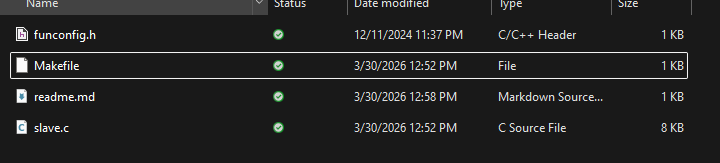

# CH32V003 Slave Code
Template code for CH32V003 slave modules
## Compiling
This is coded for cnlohr's [ch32fun](https://github.com/cnlohr/ch32fun/)
1. Clone [ch32fun](https://github.com/cnlohr/ch32fun/) repository: \
```
git clone https://github.com/cnlohr/ch32fun/
``` 
2. Create a new folder in the examples directory:  \
```
mkdir ch32fun/examples/rs485slave/
cd ch32fun/examples/rs485slave/
```
3. Copy all 3 files from here into the new project directory:  \

4. Compile  \
```
make
```